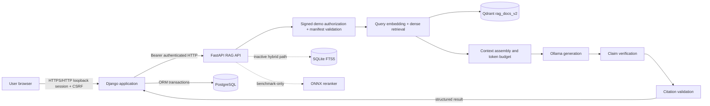

# Component architecture

```mermaid
flowchart LR
  U[User browser] -->|HTTPS/HTTP loopback session + CSRF| DJ[Django application]
  DJ -->|Bearer authenticated HTTP| API[FastAPI RAG API]
  DJ -->|ORM transactions| PG[(PostgreSQL)]
  API --> AUTH[Signed demo authorization + manifest validation]
  AUTH --> RET[Query embedding + dense retrieval]
  RET --> Q[(Qdrant rag_docs_v2)]
  RET --> CTX[Context assembly and token budget]
  CTX --> GEN[Ollama generation]
  GEN --> VERIFY[Claim verification]
  VERIFY --> CITE[Citation validation]
  CITE -->|structured result| DJ
  API -. inactive hybrid path .-> FTS[(SQLite FTS5)]
  API -. benchmark-only .-> RERANK[ONNX reranker]
```

The dashed components exist but are not part of the active dense live request path at this snapshot.
