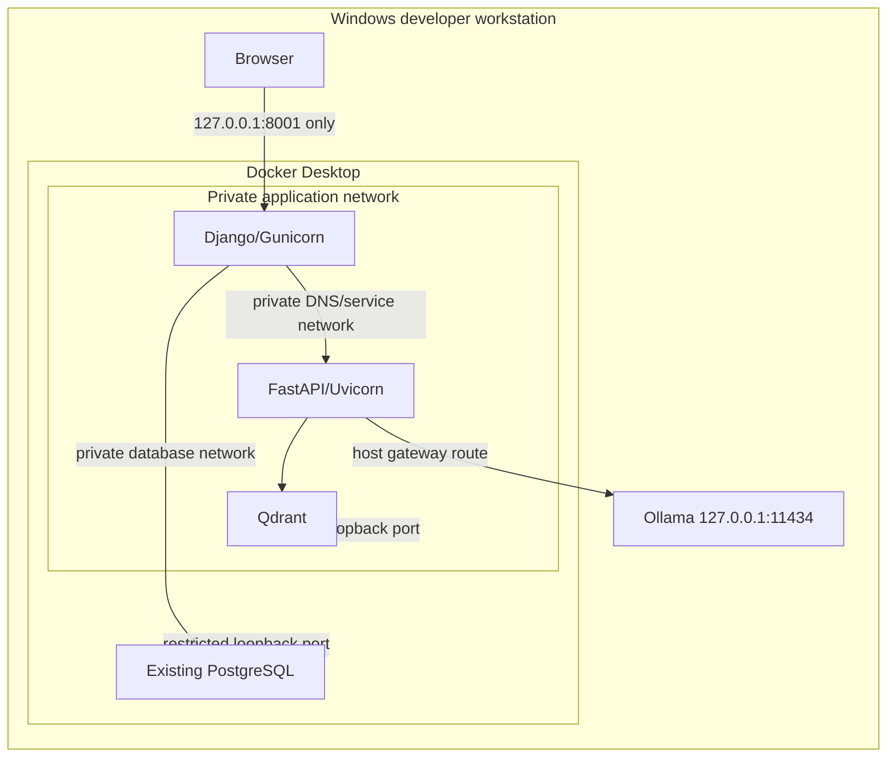

# Local deployment network

```mermaid
flowchart TB
  subgraph Host[Windows developer workstation]
    Browser[Browser]
    Ollama[Ollama 127.0.0.1:11434]
    subgraph Docker[Docker Desktop]
      subgraph AppNet[Private application network]
        Django[Django/Gunicorn]
        API[FastAPI/Uvicorn]
        Qdrant[Qdrant]
      end
      PG[Existing PostgreSQL]
    end
  end
  Browser -->|127.0.0.1:8001 only| Django
  Django -->|private DNS/service network| API
  Django -->|private database network| PG
  API --> Qdrant
  API -->|host gateway route| Ollama
  Host -. restricted loopback port .-> Qdrant
  Host -. restricted loopback port .-> PG
```

No FastAPI host port is published in the observed compose configuration. Confirm network membership and bindings after any compose changes.
