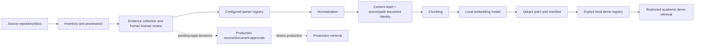

# Ingestion and indexing pipeline

```mermaid
flowchart LR
  Source[Source repository/docs] --> Inventory[Inventory and provenance]
  Inventory --> License[Evidence collection and human license review]
  License --> Parse[Configured parser registry]
  Parse --> Normalize[Normalization]
  Normalize --> Identity[Content hash + source/path document identity]
  Identity --> Chunk[Chunking]
  Chunk --> Embed[Local embedding model]
  Embed --> Index[Qdrant point and manifest]
  License -. pending legal decisions .-> Gate[Production source/document approvals]
  Index --> Demo[Explicit local demo registry]
  Gate -. blocks production .-> Serve[Production retrieval]
  Demo --> Local[Restricted academic demo retrieval]
```

Existing corpus is already indexed; the figure describes recorded stages and authorization separation, not a command to rerun ingestion.
