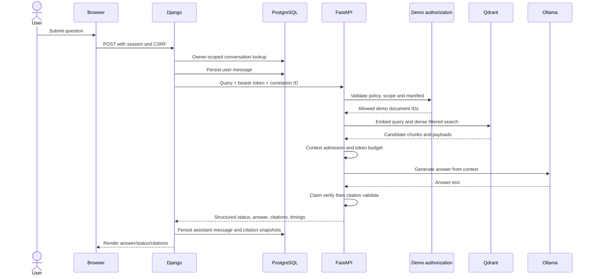

# Request sequence

```mermaid
sequenceDiagram
  actor User
  participant Browser
  participant Django
  participant DB as PostgreSQL
  participant API as FastAPI
  participant Auth as Demo authorization
  participant Q as Qdrant
  participant Ollama
  User->>Browser: Submit question
  Browser->>Django: POST with session and CSRF
  Django->>DB: Owner-scoped conversation lookup
  Django->>DB: Persist user message
  Django->>API: Query + bearer token + correlation ID
  API->>Auth: Validate policy, scope and manifest
  Auth-->>API: Allowed demo document IDs
  API->>Q: Embed query and dense filtered search
  Q-->>API: Candidate chunks and payloads
  API->>API: Context admission and token budget
  API->>Ollama: Generate answer from context
  Ollama-->>API: Answer text
  API->>API: Claim verify then citation validate
  API-->>Django: Structured status, answer, citations, timings
  Django->>DB: Persist assistant message and citation snapshots
  Django-->>Browser: Render answer/status/citations
```
