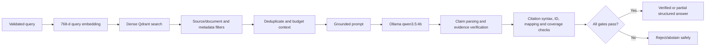

# Retrieval, generation and verification

```mermaid
flowchart LR
  Query[Validated query] --> Embed[768-d query embedding]
  Embed --> Dense[Dense Qdrant search]
  Dense --> Filter[Source/document and metadata filters]
  Filter --> Assemble[Deduplicate and budget context]
  Assemble --> Prompt[Grounded prompt]
  Prompt --> Generate[Ollama qwen3.5:4b]
  Generate --> Claims[Claim parsing and evidence verification]
  Claims --> Citations[Citation syntax, ID, mapping and coverage checks]
  Citations --> Decision{All gates pass?}
  Decision -->|Yes| Answer[Verified or partial structured answer]
  Decision -->|No| Safe[Reject/abstain safely]
```
