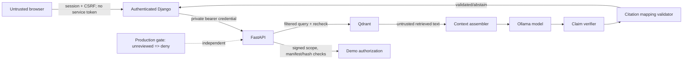

# Security boundaries

```mermaid
flowchart LR
  Browser[Untrusted browser] -->|session + CSRF; no service token| Django[Authenticated Django]
  Django -->|private bearer credential| API[FastAPI]
  API -->|signed scope, manifest/hash checks| Policy[Demo authorization]
  API -->|filtered query + recheck| Q[Qdrant]
  Q -->|untrusted retrieved text| Context[Context assembler]
  Context --> Model[Ollama model]
  Model --> Claims[Claim verifier]
  Claims --> Citations[Citation mapping validator]
  Citations -->|validated/abstain| Django
  Production[Production gate: unreviewed => deny] -. independent .-> API
```

The diagram represents checks, not a claim that prompt injection or semantic error is impossible. Legal approval and demo authorization are separate.
